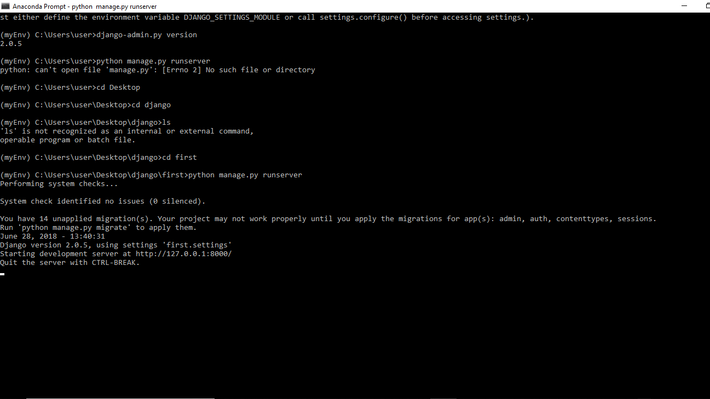
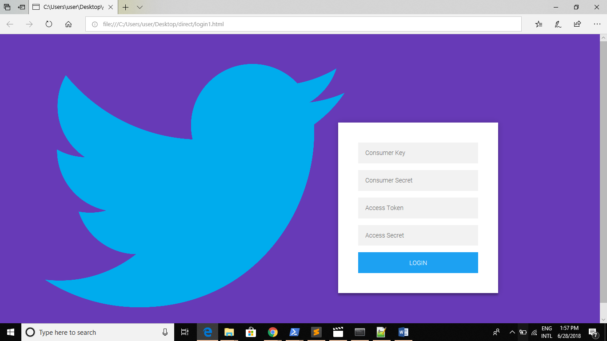

# twitterapp
####This web application will extract the URLs from the tweets from your home timeline and will be saved to be viewed in future###
####I have used Python 3.6.5, Tweepy 3.3.0 and Django 2.0.5

###Installation
**Install virtual environment
`pip install virtualenv`

**Create a virtual environment**
`virtualenv myEnv`

**Activate the virtual environment**
`myEnv\Scripts\activate`

**install django in that environment**
`pip install django`

**Download the code and navigate to the folder using the command prompt**

**Make the migrations**
`python manage.py makemigration`
`python manage.py migrate`

**Start the server**
`python manage.py runserver`

**And navigate to the link localhost, 127.0.0.1:8000**

###Basic Usage 
**User need to provide their ConsumerKey, Consumer Secret , Access Token and Access Secret Token, of the account they want to view, in the landing page**

####If the provided credentials are correct, then the user will see a different page having a list of Friends Name, the URL they tweeted within a tweet and the date on which it was tweeted

